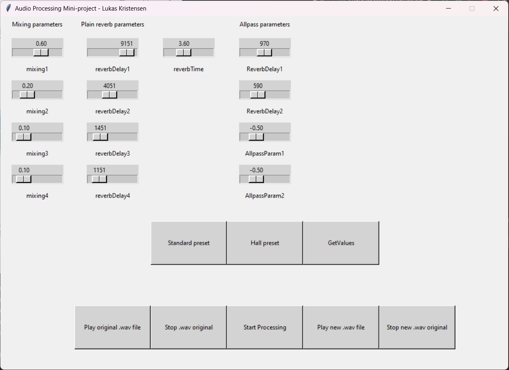
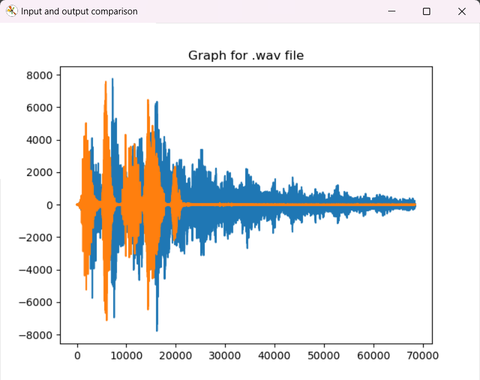

# AudioProcessing Mini project
Implementation of Schroeders Reverb Theory for the Audio Processing course in (BSc. Medialogy 4th semester, AAU)

**Overview of application interface containing configurable parameters, presets and functionality**

**Output containing the input signal (orange) and the processed signal (blue) with Schroeders Reverb based on the configured parameters**

